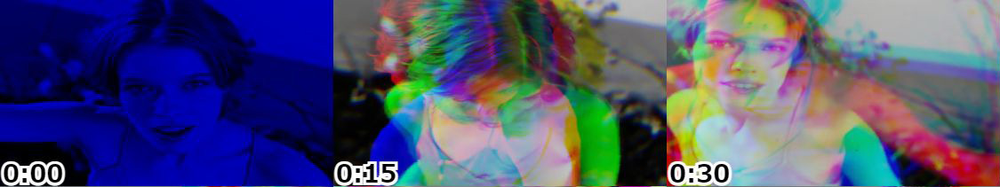

# VAM Seek × AI

**Video analysis with AI is expensive. 10-minute video at 1fps = 600 API calls.**

**What if you compressed the entire video into one image?**

48 frames → 1 grid image → 1 API call. **~600x cheaper.**

## The Numbers

| Approach | API Calls | Cost (Claude Sonnet) |
|----------|-----------|----------------------|
| Traditional (1fps) | 600 | ~$1.80/video |
| Video-to-Grid | 1 | ~$0.003/video |

Real usage per query: **~2000 input tokens, ~500 output tokens**

## How It Works

1. Load a video
2. App generates 8×6 grid (~1568×660px)
3. Ask AI anything
4. AI sees the grid, references timestamps

That's it. No cloud upload, no FFmpeg server, no frame-by-frame processing.

https://github.com/user-attachments/assets/66295cfa-d0e3-4e55-8dcd-c137f119d787

## Quick Start

```bash
git clone https://github.com/unhaya/vam-seek-ai.git
cd vam-seek-ai
git checkout v7.4
npm install
npm start
```

1. **AI > Settings** (`Ctrl+,`) → Enter API key (Claude or Gemini)
2. Load a video
3. **AI > Open Chat** (`Ctrl+Shift+A`)
4. Ask: "What happens in this video?"

## Why This Works

VAM Seek extracts frames client-side using Canvas API. No server needed.

The same thumbnail grid humans use to navigate becomes the input for AI vision. One image captures the entire video timeline.

## VAM-RGB: Causal Teleportation

**Prompt engineering should be letter writing, not command scripting.**

An egg falls in Frame 1, shatters in Frame 15. Delete Frame 7. AI still understands—it knows physics. Send cause and effect. Let intelligence fill the gap.

VAM-RGB encodes temporal causality into RGB channels—past, present, and future in a single image.



**Try it yourself** — Use [this prompt](src/renderer/plugins/grid-processor/prompts/vam-rgb.js) with the sample image above.

*[VAM-RGB Protocol (Zenodo)](https://zenodo.org/records/18338870). Free for research. Commercial use requires a license.*

| Channel | Time | Meaning |
|---------|------|---------|
| **R** (Red) | T - 0.5s | The Past (where things were) |
| **G** (Green) | T | The Present (where things are) |
| **B** (Blue) | T + 0.5s | The Future (where things will be) |

**Reading the Image:**

| Visual Pattern | Interpretation |
|----------------|----------------|
| Grayscale (R = G = B) | Static object - no motion |
| Red fringe on left, blue on right | Object moving right |
| Blue fringe on left, red on right | Object moving left |
| Wide color separation | Fast motion |
| Narrow color separation | Slow motion |

Traditional video processing treats motion blur as noise to eliminate. VAM-RGB treats it as a signal to decode.

> *"Knowledge is the imagination of deleted frames."*

*※ VAM-RGB mode is currently available for Gemini only. Claude support is planned.*

See [VAM-RGB Technical Specification](docs/VAM-RGB-Causal-Teleportation.html) for details.

## Audio Transcription

**Grid + Transcript = Complete Video Search**

Ask about audio content naturally:
- "What are they saying at the beginning?"
- "When does the speaker mention the budget?"
- "Transcribe the audio from 2:00 to 5:00"

| Provider | Method |
|----------|--------|
| Claude | Extracts segment → Local Whisper → Text to Claude |
| Gemini | Compressed audio (optimized m4a) → Direct to Gemini |

AI detects audio questions and handles transcription automatically.

## Self-Update (Sonnet/Opus)

When using advanced models (Claude Sonnet/Opus), the AI can update its own system prompt based on your feedback:
- "Remember to always respond in Japanese"
- "From now on, include timestamps in MM:SS format"

The AI writes updates to `custom-instructions.md` which persists across sessions.

## Limitations

- Fast motion between frames may be missed
- Small text unreadable at thumbnail resolution
- Audio transcription requires Gemini API key

For scene changes, visual flow, "what happens when" questions — it works. With Whisper integration, audio content is now searchable too.

## Recent Changes

### v3.1 (2026-01-26)

- **Ψ_fox Covenant**: AI classification framework documenting Fox/Observer/Workbench/Extra taxonomy
- **Ethical principle**: "Classification is observation, not judgment"
- **Prior Art**: Ψ_fox concepts registered alongside VAM-RGB technical specifications

### v7.4 / v3.0 (2026-01-25)

- **VAM-RGB v3.0**: Fixed stride encoding (R = T-0.5s, G = T, B = T+0.5s)
- **Ψ_fox format marker**: Self-describing identifier for temporal-encoded images
- **Manifesto v2.0**: Technical specification with efficiency measurements
- **Documentation**: Added Addendum (sections 13-17) covering implementation details

### Previous

- **VAM-RGB plugin system**: Grid processor architecture with standard/VAM-RGB modes
- **Optimized grid**: 375×211px cells, 112 cells/image, 2px gaps, 31px timestamps
- **Multi-provider**: Claude and Gemini support (video upload or grid mode)
- **Audio transcription**: Whisper (Claude) / native audio (Gemini) with clickable timestamps
- **Self-update**: AI can modify its own system prompt based on feedback
- **Structured timestamps**: AI receives timestamps as text, not OCR from image
- **Prompt caching**: Grid image sent once, follow-ups don't resend (90% cost reduction)

## Also Included

- Folder browser with tree view
- 2D thumbnail seeking
- Resizable panels
- Settings persistence
- Auto grid density: 2s/cell for short videos, 60s/cell for 30min+
- Clickable timestamps in AI responses
- Prompt caching: grid image sent once, follow-up questions don't resend (90% cost reduction)

## Requirements

- Node.js 18+
- Claude API key (Anthropic) or Gemini API key (Google)

## Security

API key stored in Electron's userData (plain JSON). Never leaves your machine—calls go directly to the provider.

For production: use environment variables instead of settings UI.

## Future Vision: Causal Reconstruction

VAM-RGB is not just for AI analysis—it's a foundation for reconstructing video from minimal data.

**The Concept:**
- Send 1% of the data (VAM-RGB grids)
- Receiver's AI reconstructs 100% of the video

**Why It Works:**

At 15fps, 0.5 seconds = 7 frames. VAM-RGB gives AI the start point (R) and end point (G). The AI doesn't imagine—it calculates the path between two known states. Physics does the rest.

**Potential Applications:**
- Ultra-low bandwidth video streaming
- Instant seek preview (see cause and effect before clicking)
- Archive compression with lossless temporal fidelity

*This is where VAM-RGB evolves from "video analysis tool" to "universal temporal codec."*

**Proof of Concept (2026-01):** The "seek" test proved "play" is possible. AI extracted motion vectors from static VAM-RGB images and predicted events in 15-second blind gaps. If AI can find "when the egg cracks" from one image, it can draw the crack. The decoder works. Next: connect to video generation.

**VAM-RGB is 4D ready.** By applying the VAM-RGB protocol to stereo pairs or depth-mapped frames, we encode 3D spatial causality into a static data format. The AI reconstructs the 3D volume and its motion vector simultaneously. Total spatial-temporal compression: >99.9%.

## Related

- [VAM Seek](https://github.com/unhaya/vam-seek) - The core 2D seeking library (vanilla JS, no deps)
- [VAM-RGB v3.0 Specification (Zenodo)](https://zenodo.org/records/18366858) - CC BY-NC 4.0 licensed

## Documentation (v7.4)

### VAM-RGB Protocol
- [VAM-RGB v3.0 Specification](docs/VAM-RGB-v3.0-Specification.md)
- [VAM-RGB v3.0 Addendum](docs/VAM-RGB-v3.0-Addendum.md)
- [VAM-RGB Manifesto v2.0](docs/VAM-RGB-Manifesto-v2.0-EN.md)
- [Causal Teleportation](docs/VAM-RGB-Causal-Teleportation.html)
- [Patent Specification (Prior Art)](docs/VAM-RGB-Patent-Specification-EN.md)

### Ψ_fox Framework
- [Ψ_fox Covenant](docs/Psi-fox-Covenant-EN.md) - AI classification framework (Fox/Observer/Workbench/Extra)
