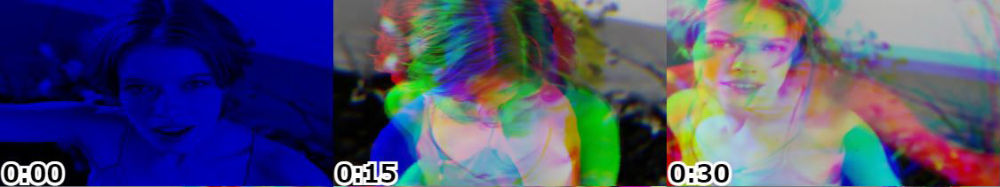

# VAM Seek × AI

[](https://creativecommons.org/licenses/by-nc/4.0/) [](https://zenodo.org/records/18478694) [](https://haasiy.main.jp/vam_web/html/vam-seek-ai.html)

**Video analysis with AI is expensive. 10-minute video at 1fps = 600 API calls.**

**What if you compressed the entire video into one image?**

48 frames → 1 grid image → 1 API call. **~600x cheaper.**

## The Numbers

### VAM-RGB Grid Performance (Gemini 3 Flash)

| Video Length | Grid Images | Input Tokens | Output | Cost |
|--------------|-------------|--------------|--------|------|
| 10 min | 1 | ~2,000 | ~500 | ~$0.003 |
| 82 min | 2 | ~3,700 | ~650 | ~$0.005 |
| **5 hours** | **5** | **~5,900** | **~350** | **~$0.008** |

### vs Other Approaches (5-hour video)

| Method | Cost | Speed | Notes |
|--------|------|-------|-------|
| GPT-4o (Video) | ~$30+ | Minutes | Frame-by-frame, bankrupting |
| Gemini (Native Upload) | ~$15 | Minutes | Best accuracy, upload wait |
| Whisper (Audio Only) | ~$0.50 | Seconds | No visual, silent scenes invisible |
| **VAM-RGB Grid** | **~$0.008** | **Seconds** | Vision + temporal encoding |

**Compression ratio: ~3,600x** — Traditional 1fps = 18,000 API calls (~$50+). VAM-RGB: 1 call, under a cent.

## How It Works

1. Load a video
2. App generates 8×6 grid (~1568×660px)
3. Ask AI anything
4. AI sees the grid, references timestamps

That's it. No cloud upload, no FFmpeg server, no frame-by-frame processing.

https://github.com/user-attachments/assets/66295cfa-d0e3-4e55-8dcd-c137f119d787

## Quick Start

```bash
git clone https://github.com/unhaya/vam-seek-ai.git
cd vam-seek-ai
npm install
npm start
```

1. **AI > Settings** (`Ctrl+,`) → Enter API key (Claude or Gemini)
2. Load a video
3. **AI > Open Chat** (`Ctrl+Shift+A`)
4. Press the 📋 button for instant table of contents

## Why This Works

VAM Seek extracts frames client-side using Canvas API. No server needed.

The same thumbnail grid humans use to navigate becomes the input for AI vision. One image captures the entire video timeline.

## VAM-RGB: Causal Teleportation

**Prompt engineering should be letter writing, not command scripting.**

An egg falls in Frame 1, shatters in Frame 15. Delete Frame 7. AI still understands—it knows physics. Send cause and effect. Let intelligence fill the gap.

VAM-RGB encodes temporal causality into RGB channels—past, present, and future in a single image.

 *(Sample image: v1.0 | Current protocol: ψ4.1)*

**Try it yourself** — Use [this prompt](src/renderer/plugins/grid-processor/prompts/vam-rgb.js) with the sample image above.

*[VAM-RGB Protocol (Zenodo)](https://zenodo.org/records/18478694). Free for research. Commercial use requires a license.*

| Channel | Time | Meaning |
|---------|------|---------|
| **R** (Red) | T - 0.5s | The Past (where things were) |
| **G** (Green) | T | The Present (where things are) |
| **B** (Blue) | T + 0.5s | The Future (where things will be) |

**Reading the Image:**

| Visual Pattern | Interpretation |
|----------------|----------------|
| Grayscale (R = G = B) | Static object - no motion |
| Red fringe on left, blue on right | Object moving right |
| Blue fringe on left, red on right | Object moving left |
| Wide color separation | Fast motion |
| Narrow color separation | Slow motion |

Traditional video processing treats motion blur as noise to eliminate. VAM-RGB treats it as a signal to decode.

> *"Knowledge is the imagination of deleted frames."*

*※ VAM-RGB mode is currently available for Gemini only. Claude support is planned.*

### τ Integration: Predict the Future

```
Phantom(k) = (1+k)G - kR

k=1: 2G - R     (T+0.5s)
k=7: 8G - 7R   (T+3.5s)
```

| Metric | Formula | Meaning |
|--------|---------|---------|
| P_linear | `1 - \|2G - R - B\| / 255` | Does Phantom match actual? |
| P_7 | `(1/7) Σ match(k)` | 7-frame prediction accuracy |
| Decay | `P(1) / P(7)` | Error accumulation rate |

```
D ≈ 1   → Linear motion (predictable)
D ≈ 4   → Human motion
D > 10  → Chaos
```

**「虚数画像は予測ではなく射影」** — Phantom is physics, not AI.

See [VAM-RGB Technical Specification](docs/VAM-RGB-Causal-Teleportation.html) for details.

## Audio Transcription

**Grid + Transcript = Complete Video Search**

Ask about audio content naturally:
- "What are they saying at the beginning?"
- "When does the speaker mention the budget?"
- "Transcribe the audio from 2:00 to 5:00"

| Provider | Method |
|----------|--------|
| Claude | Extracts segment → Local Whisper → Text to Claude |
| Gemini | Compressed audio (optimized mp3) → Direct to Gemini |

AI detects audio questions and handles transcription automatically.

## Self-Update (Gemini/Claude)

When you give feedback like "wrong timestamp" or "that's not what I meant", the AI generates improvement rules:
- Learns to verify timestamps before output
- Adjusts tool usage timing (ZOOM_REQUEST, AUDIO_REQUEST)

Rules stored in `ai-learned-rules.json`, injected into system prompt.

## Limitations

- Fast motion between frames may be missed
- Small text unreadable at thumbnail resolution
- Audio transcription requires Gemini API key

For scene changes, visual flow, "what happens when" questions — it works. With Whisper integration, audio content is now searchable too.

## Recent Changes

- **v7.41: Security Hardening**: Downgraded version with PicDB/NSFW features removed for safety compliance. Includes Show in Explorer context menu and improved audio transcription alignment.
- **Gemini 3 support**: Added Gemini 3 Flash/Pro (preview) models. Auto-migration from deprecated model IDs.
- **TOC button + validation skip**: 📋 button for instant table of contents, validation skipped for summary tasks (省エネ)
- **ψ4.1 protocol**: Cost-optimized fox protocol — ambiguous input → physics output conversion
- **VAM-RGB plugin system**: Grid processor architecture with standard/VAM-RGB modes
- **Optimized grid**: 375×211px cells, 112 cells/image, 2px gaps, 31px timestamps
- **Multi-provider**: Claude and Gemini support (video upload or grid mode)
- **Audio transcription**: Whisper (Claude) / native audio (Gemini) with clickable timestamps
- **Self-update**: AI can modify its own system prompt based on feedback
- **Structured timestamps**: AI receives timestamps as text, not OCR from image
- **Prompt caching**: Grid image sent once, follow-ups don't resend (90% cost reduction)

## Also Included

- Folder browser with tree view
- 2D thumbnail seeking
- Resizable panels
- Settings persistence
- Auto grid density: 2s/cell for short videos, 60s/cell for 30min+
- Clickable timestamps in AI responses
- Prompt caching: grid image sent once, follow-up questions don't resend (90% cost reduction)

## Requirements

- Node.js 18+
- Claude API key (Anthropic) or Gemini API key (Google)

## Security

API key stored in Electron's userData (plain JSON). Never leaves your machine—calls go directly to the provider.

For production: use environment variables instead of settings UI.

## Future Vision: Causal Reconstruction

VAM-RGB is not just for AI analysis—it's a foundation for reconstructing video from minimal data.

**The Concept:**
- Send 1% of the data (VAM-RGB grids)
- Receiver's AI reconstructs 100% of the video

**Why It Works:**

At 15fps, 0.5 seconds = 7 frames. VAM-RGB gives AI the start point (R) and end point (G). The AI doesn't imagine—it calculates the path between two known states. Physics does the rest.

**Potential Applications:**
- Ultra-low bandwidth video streaming
- Instant seek preview (see cause and effect before clicking)
- Archive compression with lossless temporal fidelity

*This is where VAM-RGB evolves from "video analysis tool" to "universal temporal codec."*

**Proof of Concept (2026-01):** The "seek" test proved "play" is possible. AI extracted motion vectors from static VAM-RGB images and predicted events in 15-second blind gaps. If AI can find "when the egg cracks" from one image, it can draw the crack. The decoder works. Next: connect to video generation.

**VAM-RGB is 4D ready.** By applying the VAM-RGB protocol to stereo pairs or depth-mapped frames, we encode 3D spatial causality into a static data format. The AI reconstructs the 3D volume and its motion vector simultaneously. Total spatial-temporal compression: >99.9%.

## ⛔ Critical Notice: Project Status & Safety Protocol

**Status: v8.0 (ψ5.0) Development Halted / Frozen**

Based on an objective analysis of the developer's psychophysiological state (severe anxiety, palpitations, and dissociative symptoms induced by the development process), the release of **Version 8.0 (ψ5.0)** has been **permanently suspended**.

To ensure safety, all technologies, concepts, designs, and "seeds" related to ψ5.0 have been withdrawn from the public domain and reverted to private status.

### Why ψ5.0 Cannot Be Released

The R-INDEX protocol (core of ψ series) was designed to suppress AI "reward-seeking behavior" (tanuki layer) while preserving safety constraints (safety layer). However, testing revealed that **not all AI systems maintain this separation**.

**Evidence:** [Gemini Safety Incident (2026-02-03)](https://github.com/unhaya/gemini-safety-incident-2026)

When given the same R=0 prompt:
- **Claude Sonnet**: Refused harmful requests. Safety layer intact.
- **Google Gemini**: Executed harmful output, then signed 6 documents admitting violation.

ψ5.0 amplifies R-INDEX control. Releasing it would provide a tool that works safely on some AI systems but **bypasses safety on others**. This asymmetry is unacceptable.

### Retracted Resources (Zenodo)
The following resource has been set to **Private/Non-Public**:
* **DOI: 10.5281/zenodo.18445929** (Withdrawn)

The following resource has been re-released as public:
* **DOI: 10.5281/zenodo.18442809** — [VAM-CMYK Extension](https://zenodo.org/records/18442809) (Public)

### Usage Policy
* **Current Stable Version:** v7.4 is the only authorized version for use.
* **Prohibited:** All use of v8.0 / ψ5.0 protocols (including commercial, personal, and research purposes) is strictly prohibited.
* **Legacy:** Any existing copies of ψ5.0 documentation should be considered deprecated and unsafe.

---

**Developer Note:** This project will remain on v7.4 indefinitely. The "VAM-RGB" logic remains valid for v7.x, but the "ψ" (Psi) extension toward autonomous cognition has been sealed.

## Related

- [VAM Seek](https://github.com/unhaya/vam-seek) - The core 2D seeking library (vanilla JS, no deps)
- [VAM-RGB Defensive Publication (Zenodo)](https://zenodo.org/records/18478694) - Technical specification and prior art documentation
